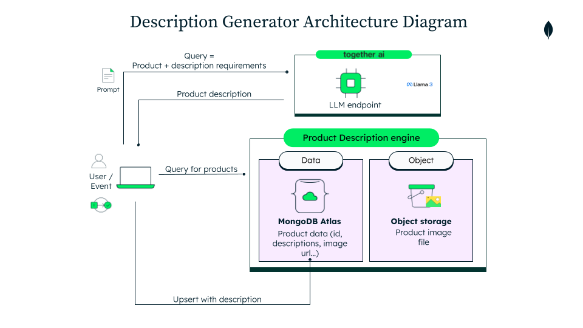

# Product Description Generator

Product onboarding to a retail e-commerce portal is a time-consuming effort for many retailers. They need to ensure they’ve created a product description that matches the image, then deploy it to their e-commerce portal. 

For multilingual portals and multiple operating geographies, this challenge of accuracy increases. With Together AI’s support for multimodal models (e.g. Llama 3.2) and MongoDB Atlas’s, we can create accurate product descriptions in multiple languages. 

## Where MongoDB Shines?

MongoDB's ability to support rich complex data types enables for a faster integration and development.

Learn more about MongoDB [here](https://www.mongodb.com/docs/manual/).

## High Level Architecture



## Tech Stack

The main tech stack components can be found below.

- [MongoDB Atlas](https://www.mongodb.com/atlas/database) for the database. 
- [Togeteher.AI](https://www.together.ai/) for generating the products descriptions using their available [chat LLMs](https://www.together.ai/models) 
- S3 buckets. This can be any file storage system. Such as: GCP buckets, Azure containers or AWS S3 buckets
- GC Virtual Machine. The deployed app of this demo is deployed on a GC virtual machine.
- Next.js [App Router](https://nextjs.org/docs/app) for the framework

## Prerequisites

Before you begin, ensure you have met the following requirements:

- MongoDB Atlas Account. Create an Atlas account at https://cloud.mongodb.com and provision a Cluster. You can follow the instructions from this article to set up your Cluster.
- Together.AI Account. This will be required to access the Models.
- AWS account. This is important if you want to upload a specific product picture from your file system instead of suing one from the provided product catalog.
- Install Node. This will be required to install the node modules which contain all the necessary packages to run our demo. 
- Install Git. This will be required to clone the demo repository.

## Run it locally

1. Navigate to the `src` folder.
2. Install dependencies by running:
```bash
npm install
```
3. Start the frontend development server with:
````bash
npm run dev
````
4. The frontend will now be accessible at http://localhost:3003 by default, providing a user interface.

## Run with Docker

Make sure to run this on the root directory.

1. To run with Docker use the following command:
```
make build
```
2. To delete the container and image run:
```
make clean
```

## Common errors

- Check that you've created a `.env.local` file that contains your valid (and working) API keys, environment and index variables.
