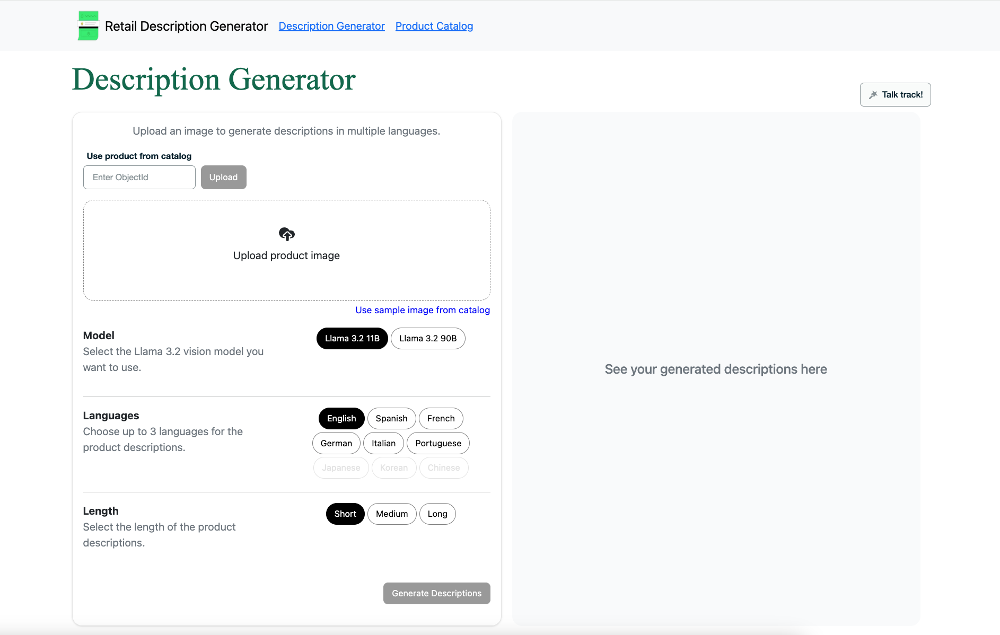

# Product Description Generator

## Table of Contents
<details>
  <ol>
    <li><a href="#abstract">Abstract</a></li>
    <li><a href="#overview">Overview</a></li>
    <li><a href="#architecture">Architecture</a></li>
    <li><a href="#prerequisites">Prerequisites</a></li>
    <li><a href="#initial-configuration">Initial Configuration</a></li>
    <li><a href="#demo-overview">Demo Overview</a></li>
    <li><a href="#authors-and-contributors">Authors & Contributors</a></li>
  </ol>
</details>

## Abstract

Product onboarding to a retail e-commerce portal is a time-consuming effort for many retailers. They need to ensure they’ve created a product description that matches the image, then deploy it to their e-commerce portal. 

For multilingual portals and multiple operating geographies, this challenge of accuracy increases. With Together AI’s support for multimodal models (e.g. Llama 3.2) and MongoDB Atlas’s, we can create accurate product descriptions in multiple languages. 

## Overview

In this repository, you will find a step-by step to build a generative AI-powered architecture that processes images using advanced vision models, generating accurate and compelling descriptions of an image. 

TogetherAI's free API Llama models are used to process the images and create compelling descriptions and  MongoDB Atlas serves as the operational data layer, leveraging its flexible data model to scale seamlessly as new descriptions are added, ensuring efficient data management and effortless scalability.

## Architecture

### Tech Stack

The main tech stack components can be found below.

- [MongoDB Atlas](https://www.mongodb.com/atlas/database) for the database. 
- [Togeteher.AI](https://www.together.ai/) for generating the products descriptions using their available [chat LLMs](https://www.together.ai/models) 
- S3 buckets. This can be any file storage system. Such as: GCP buckets, Azure containers or AWS S3 buckets
- GC Virtual Machine. The deployed app of this demo is deployed on a GC virtual machine.
- Next.js [App Router](https://nextjs.org/docs/app) for the framework

### Architecture Diagram


Let's take a look at the architecture!


At the core we have MongoDB Atlas, which contains the product catalog of our e-commerce store. We also have a cloud object storage where the unstructured data lives. In this demo, that is our image files for our catalog. This could be for example an S3, a Google Storage bucket or an Azure Blob storage.

The flow starts at the left hand side, when a new product is received. This can be a manual input or an automated batched event. Once we get the new product on the system retailers can generate the description by sending a query to TogetherAI’s endpoint. TogetherAI offers a variety of generative AI services, making it easy to run or fine-tune leading open source models with only a few lines of code.

We are using their Vision Models which can process and understand images alongside text. These models combine computer vision and natural language processing. 
Inside the request we specify which LLM type we want to use, the length, the languages in which we want this description and of course the product's image URL so the model can process it.

Then, TogetherAI takes this data and uses one of its Llama3 vision models to scan the image and generate a description that matches the specified requirements. And it returns the descriptions to the product description application.

The product along with its description will be then updated in real time inside the catalog. And at any point in time the UX writing team can enhance these descriptions from inside the application and this will be updated on the catalog.


And just as an example, take the diagram below.


Of how this architecture can scale, think of adding MongoDB Change Streams to allow real-time updates on any application listening to the catalog. For example the e-commerce portal, or a social media platform.

## Prerequisites

Before you begin, ensure you have met the following requirements:

- **MongoDB Atlas Account.** Create an Atlas account at https://cloud.mongodb.com and provision a Cluster. You can follow the instructions from this article to set up your Cluster.
- **Together.AI Account.** This will be required to access the Models.
- **AWS account.** This is important if you want to upload a specific product picture from your file system instead of using one from the provided product catalog. Create a new bucket in your AWS account and generate an IAM user with programmatic access. Save the access key and secret key for your .env file.
- **Install Node.** This will be required to install the node modules which contain all the necessary packages to run our demo. 
- **Install Git.** This will be required to clone the demo repository.

## Initial Configuration

### Step 1. Clone the repository
Start by obtaining the demo code. Open your terminal, navigate to the directory where you want to store the code, and run the following command:

```
git clone https://github.com/mongodb-industry-solutions/description-generator.git
```

### Step 2. Set up environment variables and install dependencies

Navigate to the project directory and create a file called .env.local at the root level. This file is essential for managing configuration settings, especially when it contains sensitive information such as private keys.

```
cd retail-store-v2
touch .env.local 
```

Note: For Window’s users, replace touch .env.local with echo $null >> .env.local

Open the .env.local file that you just created, and add the following environment variables. You can also see them inside the *.env.local.example*

```
TOGETHER_API_KEY=
MONGODB_URI=
DB_NAME=TogetherMDB
COLLECTION_NAME=product
S3_UPLOAD_KEY=<aws-access-key>
S3_UPLOAD_SECRET=<aws-secret-key>
S3_UPLOAD_BUCKET=<name-of-aws-bucket>
S3_UPLOAD_REGION=<region-of-your-aws-bucket>
```

Leave the fist two variables blank for now, you will retrieve its value on the next steps.

Install the node modules executing the following command:

```
npm install
```

This installation might take a few moments to complete, as all the required packages are being downloaded and installed into the project. Once the command finishes executing, a new folder named ‘node_modules’ will appear at the root level of the application code, containing the installed dependencies.

### Step 3. Retrieve your TogetherAI key

Sign up to [TogetherAI](https://www.together.ai/). 

Navigate to your account and retrieve your user key which can be found inside your Profile, then go to Settings and select API Keys. Save this key, as you will need it in your *.env* file.

Assign the user key to the TOGETHER_API_KEY variable replacing and with your actual credentials and save the changes. Your .env.local file should now resemble the following:

```
TOGETHER_API_KEY=<your-user-key>
MONGODB_URI=
DB_NAME=TogetherMDB
COLLECTION_NAME=product
S3_UPLOAD_KEY=<aws-access-key>
S3_UPLOAD_SECRET=<aws-secret-key>
S3_UPLOAD_BUCKET=<name-of-aws-bucket>
S3_UPLOAD_REGION=<region-of-your-aws-bucket>
```

### Step 4. Retrieve your connection string
A MongoDB connection string is required to connect to the cluster you created in the ‘Prerequisites’ section. Follow the steps provided in this article to retrieve your connection string.

When choosing your connection method for MongoDB, select the option labeled ‘Drivers’, as illustrated in Figure 1.


***Figure 1.*** Atlas screen to choose a connection method.

Once you select the ‘Drivers’ option copy the provided connection string. It should look something like this:

```
mongodb+srv://<username>:<password>@<clusterAddress>
```

Great job! You have obtained the final variable needed for your .env.local file. Assign the connection string to the MONGODB_URI variable replacing and with your actual credentials and save the changes. Your .env.local file should now resemble the following:

```
TOGETHER_API_KEY=<your-user-key>
MONGODB_URI=mongodb+srv://<username>:<password>@<clusterAddress>
DB_NAME=TogetherMDB
COLLECTION_NAME=product
S3_UPLOAD_KEY=<aws-access-key>
S3_UPLOAD_SECRET=<aws-secret-key>
S3_UPLOAD_BUCKET=<name-of-aws-bucket>
S3_UPLOAD_REGION=<region-of-your-aws-bucket>
```


### Step 5. Populate your database

Next, populate your database with the required data and metadata required for the demo. In the application code locate the resources/dump/TogetherMDB directory. Inside it, there are several .gz files which contain the data and metadata of the products collection.

Use the [mongorestore](https://www.mongodb.com/docs/database-tools/mongorestore/) command to load the data from the database dump into a new database within your Cluster.

Let's go back to your terminal, navigate to the directory /description-generator (the root level of the application code), and run the following command:

```
mongorestore --gzip --dir=dump/TogetherMDB --db=TogetherMDB --uri "mongodb+srv://<user>:<password>@<cluster-url>"
```

This command will create the database and collections and log its progress. 

Perfect! You now have your application code with environment variables, all the dependencies installed and the database created with the required data loaded.

Curious about how the database dump was generated? Check out the documentation for the [mongodump](https://www.mongodb.com/docs/database-tools/mongodump/) command.

### Step 6. Run the demo

#### Run Locally

Now you are all set to run the demo. Go back to the terminal, at the root of the application code execute the following command:

````bash
npm run dev
````
Then, open your browser and navigate to http://localhost:3003 and you should see the interface shown on the figure below.

'

#### Run with Docker

Make sure to run this on the root directory.

1. To run with Docker use the following command:
```
make build
```
2. To delete the container and image run:
```
make clean
```

<<<<<<< HEAD
## Authors and Contributors
=======
## Authors & Contributors
>>>>>>> cadba3add7fcb565190a4f51feff0fb5c9a3f830

[Prashant Juttukonda](https://www.mongodb.com/blog/authors/prashant-juttukonda) - Retail Principal, Product Owner

[Rodrigo Leal](https://www.mongodb.com/blog/authors/rodrigo-leal) - Retail Principal

[Genevieve Broadhead](https://www.mongodb.com/blog/authors/genevieve-broadhead) - Global lead, retail solutions

[Angie Guemes](https://www.mongodb.com/developer/author/angie-guemes-estrada/) – Sr. Specialist, Developer & Maintainer 

Florencia Arin – Sr. Specialist
